# Automate Instructor and Teaching Assistant Management

## Introduction

In this project you will combine three tools to automate the management of Instructors and Teaching Assistants for an organization that delivers coding classes in various Chapters. 

You will use:
* Process Builder - recruit Teaching Assistants via Chatter, and prep for emailing the Instructor by creating a Campaign Member child record 
* Flow - prep for emailing potential Teaching Assistants by creating Campaign Member child records
* Invokable Methods in Apex - thank the Instructor by posting a Thanks badge

Process Builder will be used to combine these tools into a single process that can be easily shared for business and IT collaboration.

Let's get started! 

## 0 - Defining the Data Model
There is some data model pre-work before you get to the process automation tools. Class sessions are modeled as Campaigns, and the Chapter and Instructor are added to the Campaign. Instructors are modeled as Salesforce licensed Users (because they need access to Work.com) AND Contacts so that they can be listed as Campaign Members. Teaching Assistants are modeled as Chatter Free licenced Users so that they have access to the Chatter group AND Contacts so that they can be listed as Campaign Members. Yes, this is fraught with peril, but it's just a sample app...roll with it.

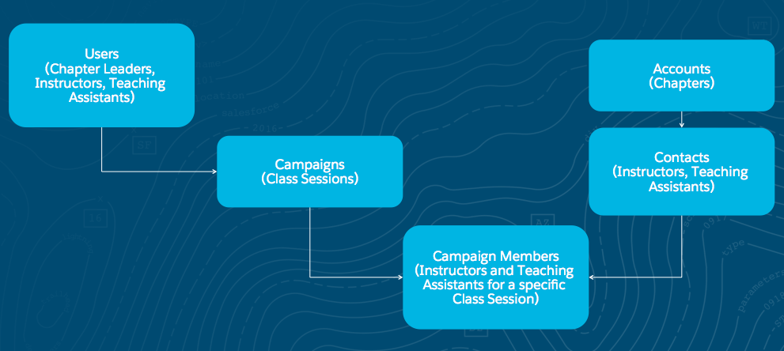

### Pre-Work Steps
1. Customize Campaign: add field for Chapter (Lookup to Account); add field for Instructor (Lookup to User); edit Campaign Type picklist to include Dev Class
2. Create Women in Tech Chatter Group: set Group Access to Public
3. Create sample data: at least one Account record for a Chapter (e.g., NYC Chapter)
4. Create sample data: one Instructor, create as User with Chatter Free license and Chatter Free User profile AND as Contact
5. Create sample data: at least two Teaching Assistants, create as Users with Chatter Free license and Chatter Free User profile AND Contact with a lookup to the Chapter Account you created
6. Add Instructors and Teaching Assistants to the Women in Tech Chatter Group
7. Enable Thanks on Global Publisher: Build | Customize | Work.com | Work.com Settings | enable Thanks Setting 'Turn on Thanks action on the Global Publisher layout.'

## 1 - New Class Sessions: Automating with Process Builder
As the Chapter Leader, you've done the legwork to identify the starting point for a new class session (modeled as a Campaign). Now you need to get the class session into the system and start recruiting Teaching Assistant volunteers. You've been doing this manually, but it is always the same thing: post to the Women in Technology Chatter Group, provide the details of the class, and ask volunteers to email you. Also, the Instructor needs to be Campaign Members so that you can send group emails for the class. Currently, you do that manually - first adding the Instructor at the Campaign level for easy visiblity and then creating a Campaign Member record for the instructor. Let's save you some time and automate that part, too.

### What you will do
1. Create a process in Process Builder for the Campaign object
2. Add the process Criteria
3. Add an Action to post to Chatter to ask for volunteers
4. Add an Action to create a Campaign Member record for the Instructor
5. Activate and test the process

### Create Process and Define Criteria
These first two automations can be done right within the Process Builder, completely declaratively! 

Lets fire up our Process Builder and create this process.


Click New and populate the details of your new process.

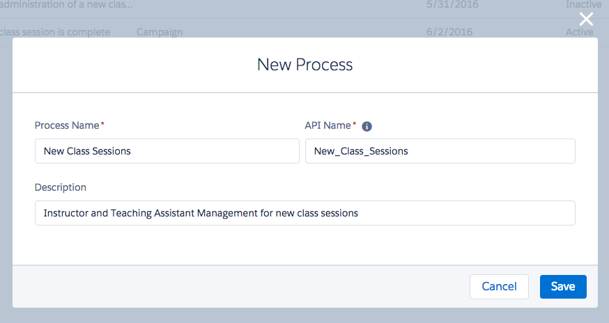

Select the Campaign object, then add the selection criteria. i.e. When does the action need to fire? In our case, Campaigns are used for many things, so we only want to fire these actions when it is a Dev Class type of Campaign, and we only want to do this for new Campaigns. Notice here we could add plenty of different conditions if required. 

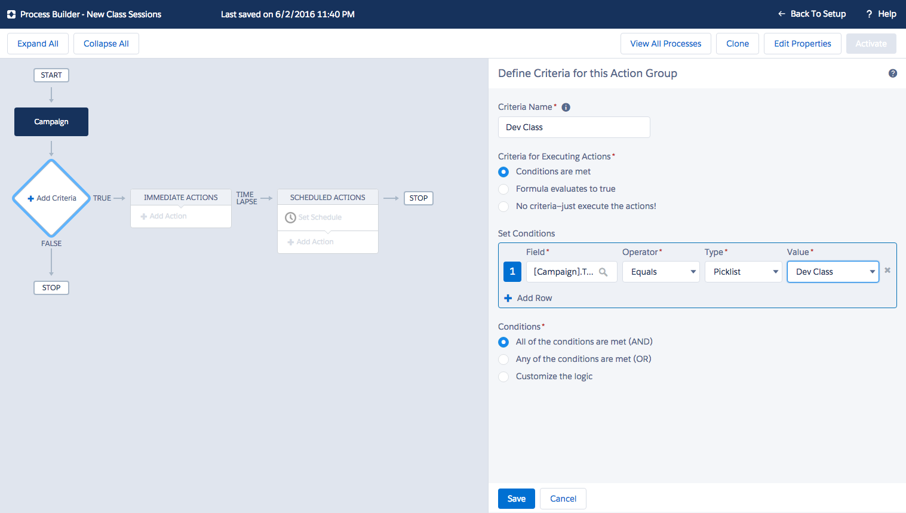

Next add an action that posts to Chatter, using merge fields to fill in the details.
Chatter message should read:
```
HELP WANTED!
I'm looking for Teaching Assistant volunteers for a {![Campaign].Class__r.Name} class taught by {![Campaign].Instructor__r.FirstName} {![Campaign].Instructor__r.LastName} on {![Campaign].StartDate}!
Please email me at {![Campaign].Owner.Email} if you are interested.
```

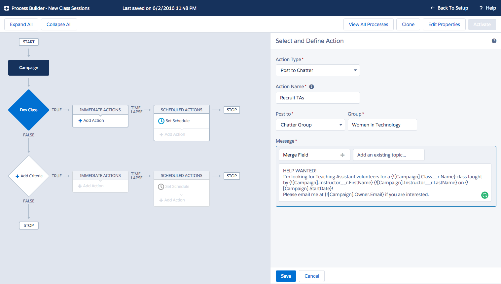

Now add an action that creates a Campaign Member for the Instructor, mapping values from the Campaign as follows:
* Campaign ID | Reference | [Campaign.Id]
* Contact ID | Reference | [Campaign.Instructor__c.Id] 
* Status | Picklist | Planned

Note: to select the Campaign.Instructor__c.Id, choose Instructor, then Contact ID.

Remove the Lead ID row, then Save.

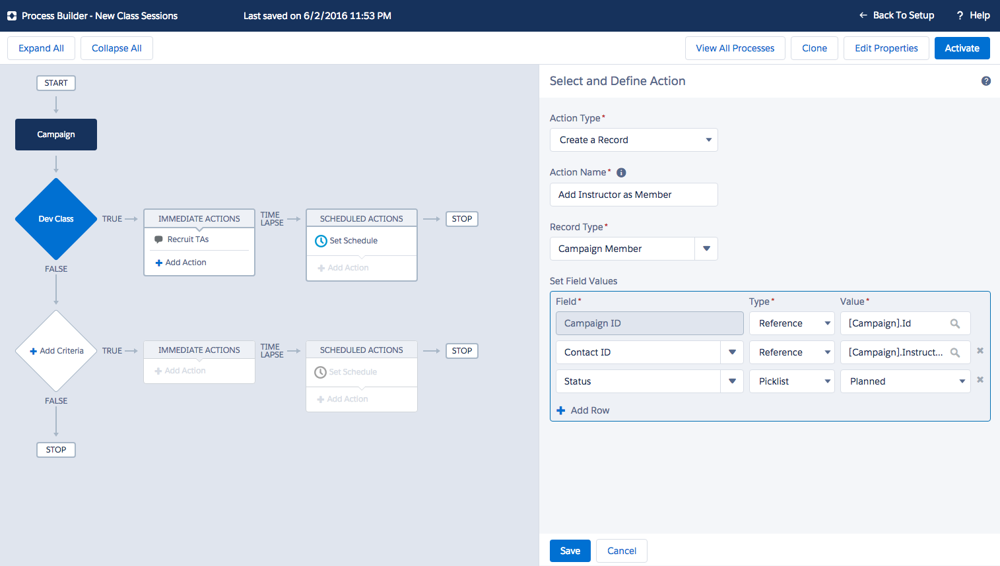

Finally, Activate the process.

### Test
Your functioning process should now be ready to test. Pretend you are the Chapter Leader and follow these steps:
1. Enter a new Campaign record, setting the Campaign Type = Dev Class; Start Date = any date; Instructor = your sample instructor; Chapter = your sample account. Save.
2. Look in the Campaign Member related list for your new Campaign. Is there a new Campaign Member record?
3. Check the Women in Technology Chatter Group. Did your Teaching Assistant recruitment post make it there? Are the merge fields correct?

## 2 - New Class Sessions: Automating with Flow
The next automation requires querying Contacts to create one or more Campaign Members. This is something we cannot do with just the Process Builder capabilities. This is where Flow comes in.

### What you will do
1. Create a new Flow
2. Add a Fast Lookup to find Contacts for the Chapter
3. Add a Loop to iterate through the collection of Contacts
4. Add an Assignment to map the Contact ID and Campaign ID into a Campaign Member Collection
5. Add a Fast Create to create Campaign Members from the collection
6. Activate and test the process

Lets fire up Flow to start building.

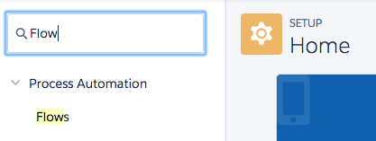

### Create Flow and Define Input Variables
Process Builder will pass in variables to the Flow for Campaign ID (aka Class Session) and Account ID (aka Chapter). 

Click New Flow and select the Resources tab.

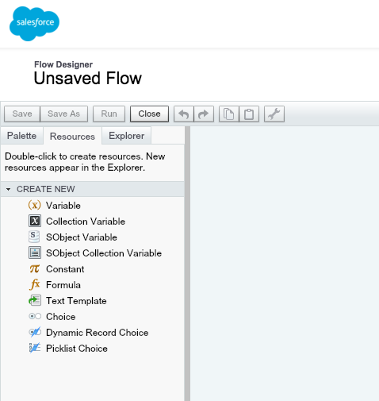

In the Resources tab, double-click Variable and fill in the information for the Campaign ID variable. Do it again for the Account ID variable. Remember to set the Input/Output Type to Input Only. This will expose the variable in the Process Builder.

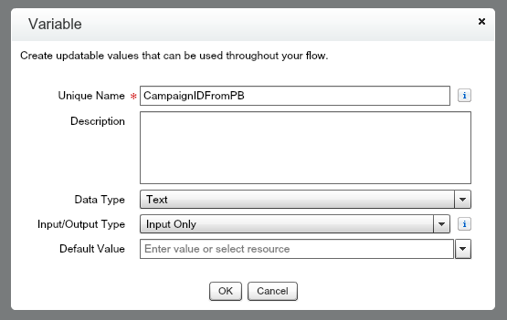

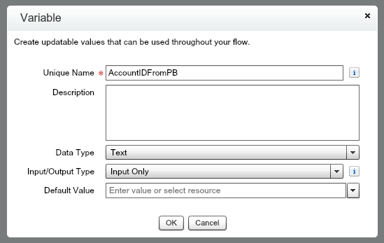

### Define Other Variables
Within the Flow you need variables to pass data between the steps. We use SObject Variables and SObject Collection Variables because they automatically know the fields in the object you select and will change if you add or remove fields.

Double-click SObject Collection Variable and fill in the information for the Contact collection variable. This is where you will store the Teaching Assistant records retrieved from the Contact object. Input/Output type should be Private.

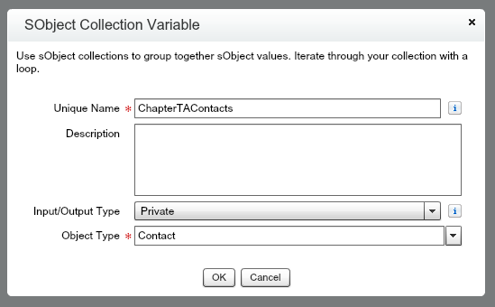

Double-click SObject Variable and fill in the information for a Contact single record variable. This is used as temporary storage when looping through the Contact collection variable. Input/Output type should be Private.

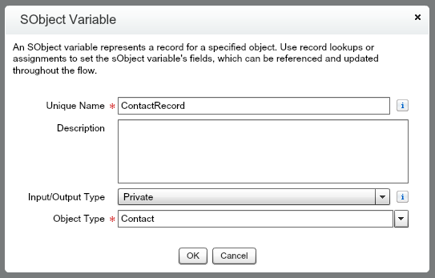

Double-click SObject Variable and fill in the information for a Campaign single record variable. This is used as temporary storage when assigning values for the new Campaign Members. Input/Output type should be Private.

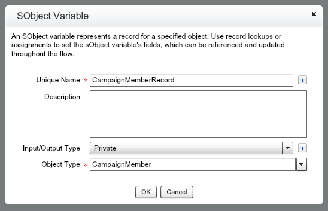

Double-click SObject Collection Variable and fill in the information for the Campaign Member collection variable. This is used to create new Campaign Member records. Input/Output type should be Private.

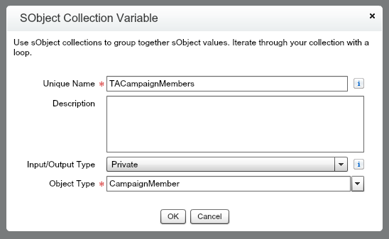

### Define Fast Lookup
With the Account ID variable passed in from the Process Builder process, we can select all of Contacts for that Account with a Fast Lookup on the Contact object. In real life, there might be other criteria in this query (like a "volunteered to be a teaching assistant" checkbox), but that's for another day.

Select the Palette tab. Drag the Fast Lookup element onto the canvas. In General Settings, set the Name to Find Chapter TAs. The Unique Name will default to Find_Chapter_TAs. Then fill in the Filters and Assignments information.

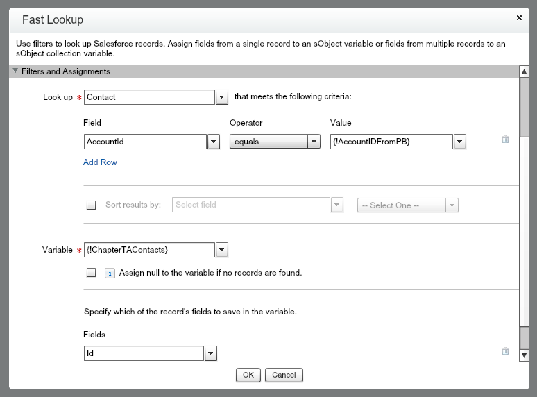

### Define Loop and Assignment
Now we need to iterate through the ChapterTAContacts collection to map the values to the TACampaignMembers collection.

From the Pallete tab, drag the Loop element onto the canvas. Fill in the information. 

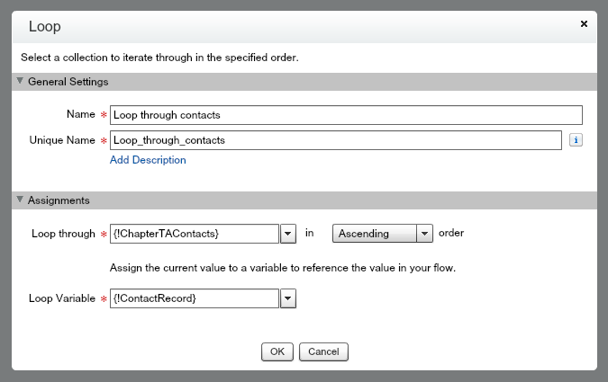

From the Pallete tab, drag the Assignment element onto the canvas. Fill in the information. This is where we use the Campaign ID we've passed from the Process Builder process.


### Define Fast Create
Now we have what we need to create the new Campaign Member records for the potential Teaching Assistants! We can do that by provide the Fast Create element with the SObject Collection variable we've populated. Boom, that's it!

Select the Palette tab. Drag the Fast Create element onto the canvas. Fill in the information.

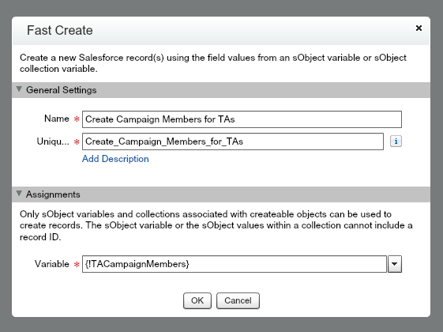

### Tell the Flow Engine What to Do
Right now your four Flow elements are disconnected and the Flow engine doesn't know where to start. To connect the elements, click the diamond at the bottom of one element and drag to another element to draw a connector line. 

Connect these elements, in this order:
1. Fast Lookup and Loop
2. Loop and Assignment
3. Loop and Fast Create 

Hover over the Fast Loopkup element and click the little green arrow that appears. That marks the Fast Lookup as the starting element.

You should now have a Flow that looks like this...

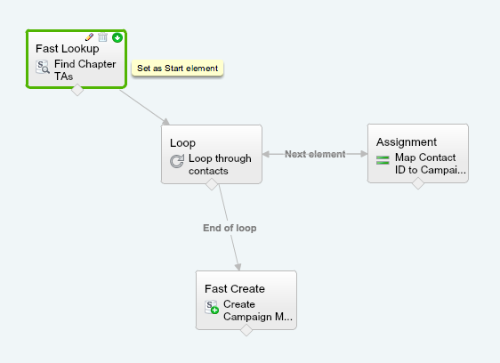

### Save and Activate
Finally, you need to save the Flow and then Activate it before you can test.

Click Save and fill in the Flow Properties. Make sure you set the Type to Autolaunched Flow. This makes it available in the Process Builder.

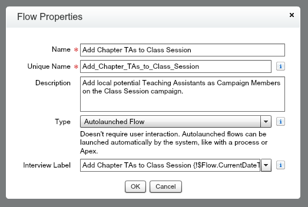

Click Close. Now you should be on the Flow Detail page. Your Flow is listed in the Flow Versions list. Click the Activate link.

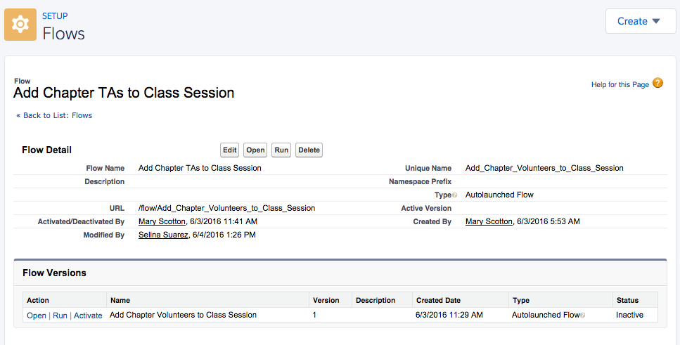

### Add the Flow to your Process
We want the potential Teaching Assistants added as Campaign Members for all new Campaigns for Dev Classes, so we should add this to the process we built in Step 1 because that is firing for all new Campaigns of Type = Dev Class. Calling a Flow from a process in Process Builder gives us the extra power we need for this automation, while keeping it in one place to make it easy to maintain and to explain to the business.

Fire up Process Builder and edit your existing process: New Class Sessions. Oh no, you can't! Flows cannot be modified once they have been activated. To modify a Flow, Clone it first. I suggest saving the clone as a version of the current process, which is the default setting.

Now you can add an action that calls your brand new Flow, and provide values for the two input variables you defined in the Flow.
* AccountIDFromPB | Reference | [Campaign.Chapter__c]
* CampaignIDFromPB | Reference | [Campaign.Id] 

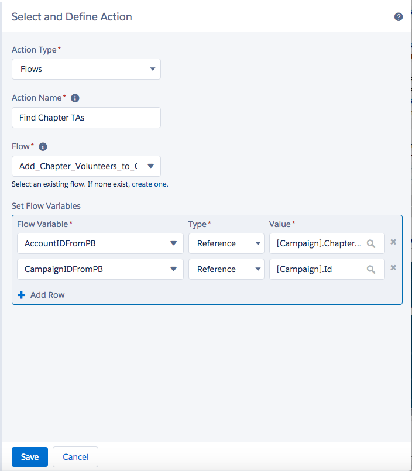

Finally, Activate the process. Activating this cloned Flow will deactivate the Flow you created and activated earlier. Only one version of a Flow can be activate at a time.

### Test
Your functioning process should now be ready to test. Once again, pretend you are the Chapter Leader and follow the same steps as above:

1. Enter a new Campaign record, setting the Campaign Type = Dev Class; Start Date = any date; Instructor = your sample instructor; Chapter = your sample account. Save.
2. Look in the Campaign Member related list for your new Campaign. Is there *more than one* new Campaign Member record now? There should be because that's what your Flow should be doing (assuming you created some Contacts for the same Account that you set the Chapter field to on the Campaign).
3. Check the Women in Technology Chatter Group. Did your Teaching Assistant recruitment post make it there? Are the merge fields correct?

## 3 - Class Session Completion: Automating with Apex Invokable Methods
The final automation requires giving a Thanks badge to the Instructor. This is something we cannot do with just the Process Builder or Flow capabilities. This is where Apex invokable methods come in. We are going to write a small piece of Apex code that will be fired from a process we define in the Process Builder.

###Apex Class
Now we can create the Apex code that is capable of posting a Thanks badge to our awesome Instructor's profile page. The methods and classes here will allow Badge Name, Giver ID, Receiver ID and Thanks Message to be passed in from the process we define in Process Builder. 

```
global without sharing class GiveWorkThanksAction {

    @InvocableMethod(label='Give a Thanks Badge')
    global static void giveWorkBadgeActionsBatch(List<GiveWorkThanksRequest> requests) {
        for(GiveWorkThanksRequest request: requests){
            giveWorkBadgeAction(request);
        }
    }

    public static void giveWorkBadgeAction(GiveWorkThanksRequest request) {
        WorkThanks newWorkThanks = new WorkThanks();

                newWorkThanks.GiverId = request.giverId;
                newWorkThanks.Message = request.thanksMessage;
                newWorkThanks.OwnerId = request.giverId;

        insert newWorkThanks;


        WorkBadge newWorkBadge = new WorkBadge();

                // newWorkBadge.DefinitionId should be set to the ID for the Competitor Badge within this Org
                WorkBadgeDefinition workBadgeDef = [SELECT Id,Name FROM WorkBadgeDefinition WHERE Name = :request.badgeName Limit 1];

                newWorkBadge.DefinitionId = workBadgeDef.Id;
                newWorkBadge.RecipientId = request.receiverId;
                newWorkBadge.SourceId = newWorkThanks.Id ;
                //newWorkBadge.GiverId = request.giverId;

        insert newWorkBadge;

        WorkThanksShare newWorkThanksShare = new WorkThanksShare();

                newWorkThanksShare.ParentId = newWorkThanks.Id ;
                newWorkThanksShare.UserOrGroupId = request.receiverId;

                newWorkThanksShare.AccessLevel = 'Edit';
                insert newWorkThanksShare;

        FeedItem post = new FeedItem();

                post.ParentId = request.receiverId;
                post.CreatedById = request.giverId;
                post.Body = request.thanksMessage;
                post.RelatedRecordId = newWorkThanks.Id ;
                post.Type = 'RypplePost';

        insert post;

    }

    global class GiveWorkThanksRequest {
        @InvocableVariable(label='Giver Id' required=true)
        global Id giverId;

        @InvocableVariable(label='Receiver Id' required=true)
        global Id receiverId;

        @InvocableVariable(label='Thanks Message' required=true)
        global String thanksMessage;

        @InvocableVariable(label='Badge Name' required=true)
        global String badgeName;
    }
}
```
Notice the [@InvocableVariable](https://developer.salesforce.com/docs/atlas.en-us.apexcode.meta/apexcode/apex_classes_annotation_InvocableVariable.htm) and [@InvocableMethod](https://developer.salesforce.com/docs/atlas.en-us.apexcode.meta/apexcode/apex_classes_annotation_InvocableMethod.htm) annotations on this class that allow these methods to be exposed to the configuration tools in the Salesforce system. 

### Build the Process
Now we can define the business process that will cause the Thanks automation to fire and post a badge to the Instructor. Here we get to see one of the really powerful features of Salesforce when you are writing code, the ability to bridge from clicks to code seamlessly! 

Fire up Process Builder and create this rule.

Click New and populate the details of your new Process.

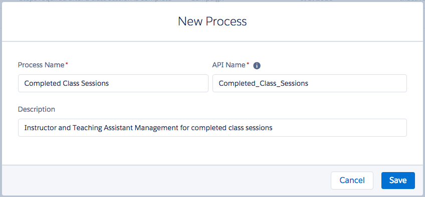

Select the Campaign object and specify to start the process when a record is created or edited. Then add the selection criteria. i.e. When does the action need to fire? In our case, we want to thank our Instructors only when a class is complete and also only for Dev Class campaigns (not ALL campaigns!). 

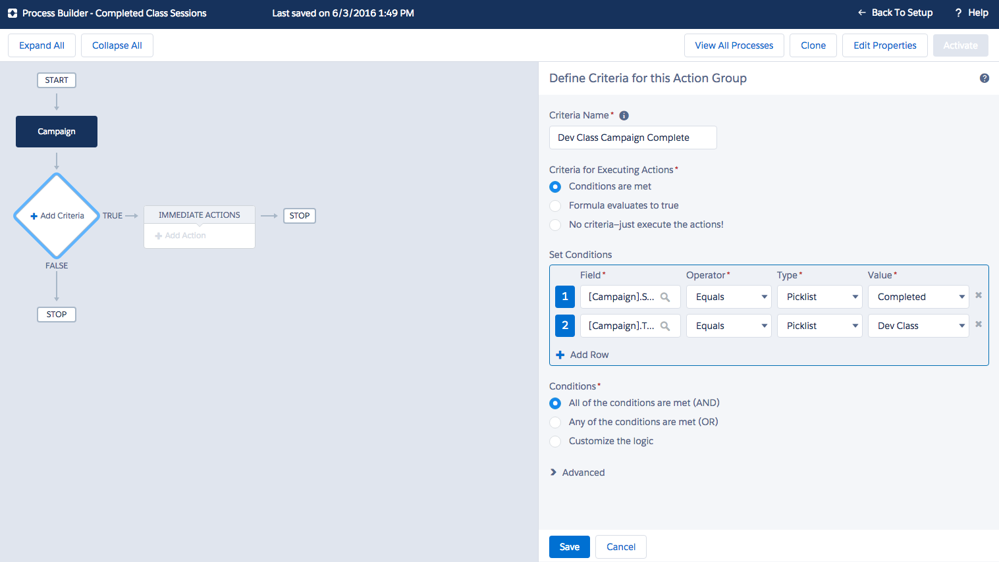

Now we can add an action that calls our freshly minted Apex class, ready to accept the four parameters that we annotated with the @InnvocableVariable annotation.
* Badge Name | String | Thanks
* Giver ID | Reference | [Campaign.OwnerId] 
* Receiver ID | Reference | [Campaign.Instructor__c] 
* Thanks Message | String | You are awesome!

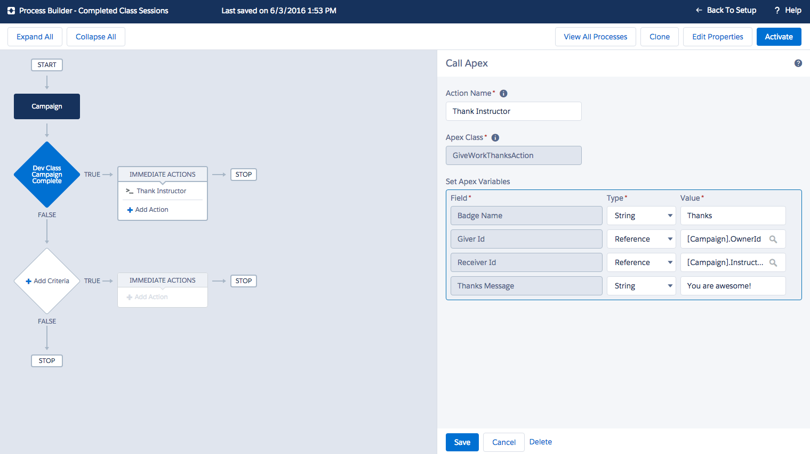

Finally, Activate the process.

### Test
Your functioning process should now be ready to test. Pretend you are the Chapter Leader and follow these steps:
1. Edit an existing Campaign of Type = Dev Class. Set the Status to Completed. Save.
2. Go to the Chatter tab. Is there a new post, thanking the Instructor? Does it have the Thanks badge?
 
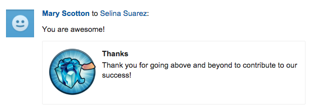

What else will you need to do before you can deploy this process in a production org?


