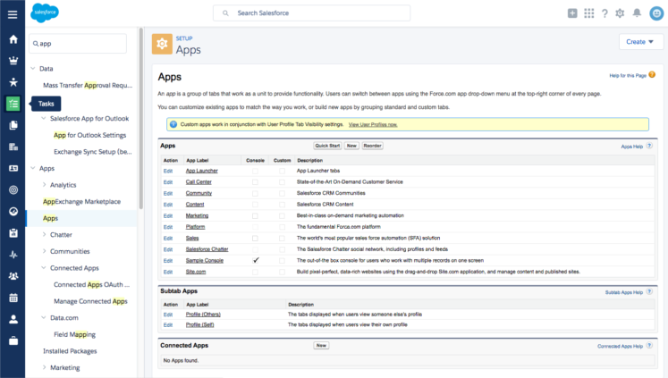
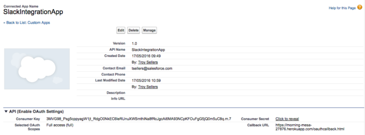

#Salesforce Process Automation Tools

## Introduction

In this project we will be using three different process automation tools and combining them to provide a solution to managing Instructors and Teaching Assistants for web development classes. 

TBD: screen shot of data model

There are three process automation tools that you will use:
* Process Builder - orchestrate all automation actions; recruit Teaching Assistants via Chatter, and prep for emailing the Instructor by creating a Campaign Member child record 
* Flow - prep for emailing potential Teaching Assistants by creating Campaign Member child records
* Apex - thank each Instructor and Teaching Assistant by posting a Thanks badge

Let's get started! 

this is how to make a URL in markup [heavy lifting](http://coenraets.org/blog/2016/04/salesforce-slack-bot/) 

## 0 - Defining the Data Model
There is some data model pre-work before you get to the process automation tools. Class sessions are modeled as Campaigns, and the Chapter and Instructor are added to the Campaign. Instructors are modeled as Salesforce licensed Users (because they need access to Work.com) AND Contacts so that they can be listed as Campaign Members. Teaching Assistants are modeled as Chatter Free licenced Users so that they have access to the Chatter group AND Contacts so that they can be listed as Campaign Members. Yes, this is fraught with peril, but it's just a sample app...roll with it.

### Pre-Work Steps
1. Customize Campaign: add field for Chapter (Lookup to Account); add field for Instructor (Lookup to User); edit Campaign Type picklist to include Dev Class
2. Create Women in Tech Chatter Group: set Group Access to Public
3. Create sample data: at least one Account record for a Chapter (e.g., NYC Chapter)
4. Create sample data: one Instructor, create as User with Chatter Free license and Chatter Free User profile AND as Contact
5. Create sample data: at least two Teaching Assistants, create as Users with Chatter Free license and Chatter Free User profile AND Contact with a lookup to the Chapter Account you created
6. Add Instructors and Teaching Assistants to the Women in Tech Chatter Group
7. Enable Thanks on Global Publisher: Build | Customize | Work.com | Work.com Settings | enable Thanks Setting 'Turn on Thanks action on the Global Publisher layout.'

## 1 - Automating Processes for New Class Sessions, Part 1
As the Chapter Leader, you've done the legwork to identify the starting point for a new class session (modeled as a Campaign): the Class, an Instructor, and the Date. Now you need to get the class session into the system and start recruiting Teaching Assistant volunteers. You've been doing this manually, but it is always the same thing: post to the Women in Technology Chatter Group, provide the details of the class, and ask volunteers to email you. Also, the Instructor and the Teaching Assistants need to be Campaign Members so that you can send group emails for the class. Currently, you do that manually - first adding the Instructor at the Campaign level for easy visiblity and then creating a Campaign Member record for the instructor. Let's save you some time and automate that part, too.

### What you will do
1. Create a process in Process Builder for the Campaign object
2. Add the process Criteria
3. Add an Action to post to Chatter to ask for volunteers
4. Add an Action to create a Campaign Member record for the Instructor
5. Activate and test the process

## Automating with Process Builder...
### Create Process and Define Criteria
These first two automations can be done right within the Process Builder, completely declaratively! 

Lets fire up our Process Builder and create this rule.

Click New and populate the details of your new Process.


Select the Campaign object, then add the selection criteria. i.e. When does the action need to fire? In our case, Campaigns are used for many things, so we only want to fire these actions when it is a Dev Class type of Campaign, and we only want to do this for new Campaigns. Notice here we could add plenty of different conditions if required. 


Next add an action that posts to Chatter, using merge fields to fill in the details.
Chatter message should read:
```
HELP WANTED!
I'm looking for Teaching Assistant volunteers for a {![Campaign].Class__r.Name} class taught by {![Campaign].Instructor__r.FirstName} {![Campaign].Instructor__r.LastName} on {![Campaign].StartDate}!
Please email me at {![Campaign].Owner.Email} if you are interested.
```


Now add an action that creates a Campaign Member for the Instructor, mapping values from the Campaign as follows:
* Campaign ID | Reference | [Campaign.Id]
* Contact ID | Reference | [Campaign.Instructor__c.Id] 
* Status | Picklist | Planned

Note: to select the Campaign.Instructor__c.Id, choose Instructor, then Contact ID.

Remove the Lead ID row, then Save.


Finally, Activate the process.

### Test
Your functioning process should now be ready to test. Pretend you are the Chapter Leader and follow these steps:
1. Enter a new Campaign record, setting the Campaign Type = DEV Class; Class field = your sample class; Start Date = any date; Instructor = your sample instructor. Save.
2. Refresh the Campaign page. Is there a new Campaign Member record?
3. Check the Women in Technology Chatter Group. Did your Teaching Assistant recruitment post make it there? Are the merge fields correct?

## 2 - Automating Processes for New Class Sessions, Part 2
The next automation requires querying Contacts to create one or more Campaign Members. This is something we cannot do with just the Process Builder capabilities. This is where Flow comes in.

## 3 - Automating Class Session Completion
The final automation requires giving a Thanks badge to the Instructor. This is something we cannot do with just the Process Builder or Flow capabilities. This is where Apex invokable methods come in. We are going to write a small piece of Apex code that will be fired from a process we define in the Process Builder.

###Apex Class
Now we can create the Apex code that is capable of posting a Thanks badge to our awesome Instructor's profile page. The methods and classes here will allow Badge Name, Giver ID, Receiver ID and Thanks Message to be passed in from the process we define in Process Builder. 

```
global without sharing class GiveWorkThanksAction {

    @InvocableMethod(label='Give a Thanks Badge')
    global static void giveWorkBadgeActionsBatch(List<GiveWorkThanksRequest> requests) {
        for(GiveWorkThanksRequest request: requests){
            giveWorkBadgeAction(request);
        }
    }

    public static void giveWorkBadgeAction(GiveWorkThanksRequest request) {
        WorkThanks newWorkThanks = new WorkThanks();

                newWorkThanks.GiverId = request.giverId;
                newWorkThanks.Message = request.thanksMessage;
                newWorkThanks.OwnerId = request.giverId;

        insert newWorkThanks;


        WorkBadge newWorkBadge = new WorkBadge();

                // newWorkBadge.DefinitionId should be set to the ID for the Competitor Badge within this Org
                WorkBadgeDefinition workBadgeDef = [SELECT Id,Name FROM WorkBadgeDefinition WHERE Name = :request.badgeName Limit 1];

                newWorkBadge.DefinitionId = workBadgeDef.Id;
                newWorkBadge.RecipientId = request.receiverId;
                newWorkBadge.SourceId = newWorkThanks.Id ;
                //newWorkBadge.GiverId = request.giverId;

        insert newWorkBadge;

        WorkThanksShare newWorkThanksShare = new WorkThanksShare();

                newWorkThanksShare.ParentId = newWorkThanks.Id ;
                newWorkThanksShare.UserOrGroupId = request.receiverId;

                newWorkThanksShare.AccessLevel = 'Edit';
                insert newWorkThanksShare;

        FeedItem post = new FeedItem();

                post.ParentId = request.receiverId;
                post.CreatedById = request.giverId;
                post.Body = request.thanksMessage;
                post.RelatedRecordId = newWorkThanks.Id ;
                post.Type = 'RypplePost';

        insert post;

    }

    global class GiveWorkThanksRequest {
        @InvocableVariable(label='Giver Id' required=true)
        global Id giverId;

        @InvocableVariable(label='Receiver Id' required=true)
        global Id receiverId;

        @InvocableVariable(label='Thanks Message' required=true)
        global String thanksMessage;

        @InvocableVariable(label='Badge Name' required=true)
        global String badgeName;
    }
}
```
Notice the [@InvocableVariable](https://developer.salesforce.com/docs/atlas.en-us.apexcode.meta/apexcode/apex_classes_annotation_InvocableVariable.htm) and [@InvocableMethod](https://developer.salesforce.com/docs/atlas.en-us.apexcode.meta/apexcode/apex_classes_annotation_InvocableMethod.htm) annotations on this class that allow these methods to be exposed to the configuration tools in the Salesforce system. 

### Build the Process
Now we can define the business process that will cause the Thanks automation to fire and post a badge to the Instructor. Here we get to see one of the really powerful features of Salesforce when you are writing code, the ability to bridge from clicks to code seamlessly! 

Lets fire up our Process Builder and create this rule.

Click New and populate the details of your new Process.


Select the Campaign object and specify to start the process when a record is created or edited. Then add the selection criteria. i.e. When does the action need to fire? In our case, we want to thank our Instructors only when a class is complete and also only for Dev Class campaigns (not ALL campaigns!). 


Now we can add an action that calls our fresly minted Apex class, ready to accept the four parameters that we annotated with the @InnvocableVariable annotation.


Finally, Activate the process.

### Test
Your functioning process should now be ready to test. Pretend you are the Chapter Leader and follow these steps:
1. Edit an existing Campaign of Type = Dev Class. Set the Status to Completed. Save.
2. Go to the Chatter tab. Is there a new post, thanking the Instructor? Does it have the Thanks badge?
 


What else will you need to do before you can deploy this process in the production?

## 2 - View Salesforce Data Using Slash Commands
Now our project team is fully aware of the latest and greatest news on deals in real time from Salesforce, but what if they wanted to interact with Salesforce data themselves? Should these users really have to leave their beloved Slack interface if they just wanted to see a few opportunities, contacts or to create a simple case? Luckily we have a few handy developers on staff who can pull together a little integration that will allow just this. Lets have a look at [Slack Slash Commands](https://api.slack.com/slash-commands) and another awesome component from the Salesforce App Cloud, Heroku. 

We want to setup a few different scenarios here :
* Show the top opportunities from Salesforce  (/pipeline[number to show])
* Search for a Salesforce Contact in the Slack UI (/contact[search key])
* Create a customer service Case from the Slack UI (/case[subject:description])

To achieve this we are going to :
* Setup a Salesforce Connected App
* Create a Node.js application that will serve as the proxy between Salesforce and Slack (well, actually we are just going to copy one!)
* Configure Slash Commands in Slack


### Architecture
We need to setup a small Heroku app to broker the communcation between Slack and Salesforce. This app is going to use [Node.js](https://nodejs.org/) and the [nForce](https://github.com/kevinohara80/nforce) module to provide convenience methods for accessing Salesforce. If you have yet to get your [Heroku](www.heroku.com) account, head over and sign up for the free tier. 


We need to let Salesforce know that an application is going to want to use the API, so we have to configure a the Connected App in our developer environment. Go to Apps to create a new Connected App. 



Configure, don't worry about the callback URL yet as we are going to change that later! 


Now we can deploy this [application](https://github.com/ccoenraets/slackforce) into our newly (or well used) Heroku environment, it is a trivial thing to deploy this appliction thanks to Heroku... try it, just click this button. 

[](https://heroku.com/deploy?template=https://github.com/ccoenraets/slackforce)

You will be asked to configure some properites on this application

* SF_CLIENT_ID - enter the Consumer Key of your Salesforce Connected App
* SF_CLIENT_SECRET - enter the Consumer Secret of you Salesforce Connected App
* SF_USER_NAME - this is the username of the Salesforce integration user
* SF_PASSWORD - this is the password for this user
* SLACK_OPPORTUNITY_TOKEN, SLACK_CONTACT_TOKEN and SLACK_CASE_TOKEN are blank for now (we get back to this)

Once you have deployed, you should see the an output similar to this. 


### Create the Slack Commands
We now need to do some configuration work in the Slack UI to create the actual Slack commands that end users will need. In your browser, open up Slack (if you haven't already). As an example, my Slack team URL is https://sforce-slack-demo.slack.com. We are going to add another integration, however this time we will add Slash Command (remember our first one was a Webhook)


Click install and then add the following commands to your Team.


Command | URL | Method | Custom Name
--------|-----|--------|------------
/pipeline | https://app_name.herokuapp.com/pipeline | POST | Top Opportunities
/contact | https://app_name.herokuapp.com/contact | POST | Salesforce Contacts
/case | https://app_name.herokuapp.com/case | POST | Salesforce Cases

You will need to create a separate Slash Command for each use case, configuring a Slash command should look like this. This is also where you will get you Slack Token that needs to be configured in your Heroku application.


Now we have created our Slash Commands, lets update our Heroku app with the Tokens that were just generated for each command. From the Settings tab in your [Heroku Dashboard](dashboard.heroku.com), reveal the config vars and edit. Oh, and don't forget to generate and append your security token to the SF_PASSWORD variable!!


Lastly, remember we said there was a Connected App setting we needed to come back to? Thats right, our callback URL is not a localhost address anymore but should now point to our Heroku app.



Congratulations, you should now be able to pull Salesforce data into your Slack stream.

[](https://youtu.be/xB-1SsUoBHk)


## 3 - Its all in the Bot

In the last part of our workshop we are going to create an integration using bots, we are going to monitor Slack channels and respond to Salesforce requests expressed in natural language. 

We are going to create an applciation that opens a Websocket connection to Slack, allowing the bot to listen to the Slack channel as well as any direct messages that users send directly to the bot. We are going to use [Botkit](https://github.com/howdyai/botkit) to abstract some of the low level details of Slack (and [Facebook](https://blog.howdy.ai/botkit-for-facebook-messenger-17627853786b)) bot buildling. 

To finish off today, we are going to :
* Configure another Salesforce Connected App
* Create another Heroku App
* Create a bot user in Slack

### 1 - Create a Salesforce Connected App

Create Connected app.


### 2 - Create the Slack Bot User

Lets add a bot to our Slack Team. 


### 3 - Create the Heroku App

Go ahead and use your Heroku again (or follow this for deploying locally)

[](https://heroku.com/deploy?template=https://github.com/ibigfoot/salesforce-bot-slack)

Setup your config vars, again to remember that your security token should be appended to the password.


You should now be able to have a conversation with your Salesforce Bot!

[](https://youtu.be/1EPNbHi-3UY)


