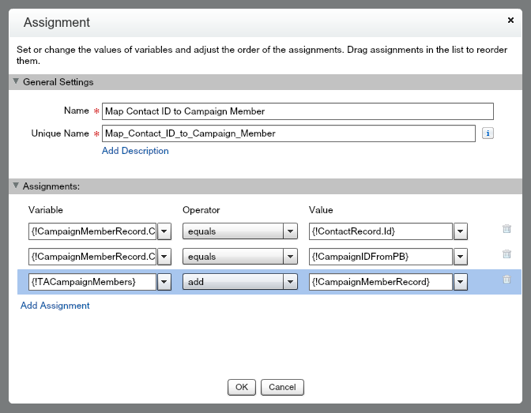

# Automate Instructor and Teaching Assistant Management

## Introduction

In this project you will combine three tools to automate the management of Instructors and Teaching Assistants for an organization that delivers coding classes in various Chapters. 

You will use:
* Process Builder - recruit Teaching Assistants via Chatter 
* Flow - prep to recruit Teaching Assistants via local Contacts
* Invokable Methods in Apex - thank the Instructor by posting a Thanks badge

You will combine these actions in Process Builder, enabling you to easily maintain the processes and collaborate with other members of your team with the process diagram.

Let's get started! 

## 0 - Defining the Data Model
There is some data model pre-work before you get to automating these processes. Class sessions are modeled as Campaigns, and the Chapter (Account) and Instructor (User) are added to the Campaign. Teaching Assistants are modeled as Contacts.


### Pre-Work Steps
No sense waiting, let's get started...

1. Customize Campaign: add field named Chapter (Lookup to Account); add field named Instructor (Lookup to User); edit Type picklist to include 'Dev Class' value.
2. Create sample data: at least one Account record for a Chapter (e.g., NYC Chapter).
3. Create sample data: at least two Teaching Assistants, create as Contacts with a lookup to the Chapter (Account) you created.
4. Create sample data: one Instructor, create as User with Salesforce license and Standard User profile.
5. Create Instructors & Teaching Assistants Chatter Group: set Group Access to Public.
7. From Classic Setup UI, enable Thanks on Global Publisher: Build | Customize | Work.com | Work.com Settings | enable Thanks Setting 'Turn on Thanks action on the Global Publisher layout.'

## 1 - New Class Sessions: Automating with Process Builder
As the Chapter Leader, you've done the legwork to identify the starting point for a new class session (modeled as a Campaign). Now you need to get the class session into the system and start recruiting Teaching Assistant volunteers. You've been doing this manually, but it is always the same thing: post to the Instructors & Teaching Assistants Chatter Group, provide the details of the class, and ask volunteers to email you. Save yourself some time and automate that Chatter post.

### What you will do
1. Create a process in Process Builder for the Campaign object
2. Add the process Criteria
3. Add an Action to post to Chatter to ask for volunteers
4. Activate and test the process

### Create Process and Define Criteria
This first automation can be done right within the Process Builder, completely declaratively! 

Lets fire up our Process Builder and create this process.


Click New and populate the details of your new process.


Select the Campaign object, then add the selection criteria. i.e. When does the action need to fire? In our case, Campaigns are used for many things, so we only want to fire these actions when it is a Dev Class type of Campaign, and we only want to do this for new Campaigns. Notice here we could add plenty of different conditions if required. 


Next add an action that posts to Chatter, using merge fields to fill in the details.
Chatter message should read:
```
HELP WANTED!
I'm looking for Teaching Assistant volunteers for a {![Campaign].Name} class taught by {![Campaign].Instructor__r.FirstName} {![Campaign].Instructor__r.LastName} on {![Campaign].StartDate}!
Please email me at {![Campaign].Owner.Email} if you are interested.
```


That's it! Now, activate the process.

### Test
Your functioning process should now be ready to test. Enter data as you would as the Chapter Leader, following these steps:

1. Enter a new Campaign record, setting Campaign Name = the name of a coding class; Campaign Type = Dev Class; Start Date = any date; Chapter = your sample account; Instructor = your sample instructor. Save.
2. Check the Instructors & Teaching Assistants Chatter Group. Did your Teaching Assistant recruitment post make it there? Are the merge fields correct in the post? If yes, you just saved all of the Chapter Leaders a little bit of time. Multiple that savings by 50 chatpers and dozens of classes a year in each, that little bit adds up! 

## 2 - New Class Sessions: Automating with Flow
Only people in your coding class organization are in the Chatter group, but some Teaching Assistants are local Chapter members. Chapter Members are modeled as Contacts, and the next automation requires querying Contacts to create one or more Campaign Members. This is something you cannot do with just the Process Builder capabilities. This is where Flow comes in.

### What you will do
1. Create a new Flow
2. Add a Fast Lookup to find Contacts for the Chapter
3. Add a Loop to iterate through the collection of Contacts
4. Add an Assignment to map the Contact ID and Campaign ID into a Campaign Member collection
5. Add a Fast Create to create Campaign Members from the collection
6. Activate and test the process

Fire up Flow to start building.


### Create Flow and Define Input Variables
Process Builder will pass in variables to the Flow for Campaign ID (aka Class Session) and Account ID (aka Chapter). You will create these variables, and variables needed to pass data between elements in your Flow, in the Resources tab. After you create them, you can view and edit them in the Explorer tab.

Click New Flow and select the Resources tab.


In the Resources tab, double-click Variable and fill in the information for the Campaign ID variable. Do it again for the Account ID variable. Remember to set the Input/Output Type to Input Only. This will expose the variable in the Process Builder.


### Define Other Variables
Within the Flow you need variables to pass data between the elements. You'll use SObject Variables and SObject Collection Variables because they automatically know the fields in the object you select and will change if you add or remove fields.

Double-click SObject Collection Variable and fill in the information for the Contact collection variable. This is where you will store the Teaching Assistant records retrieved from the Contact object. Input/Output type should be Private.


Double-click SObject Variable (not SObject Collection Variable, because for this part we only need to store a single record) and fill in the information for the Contact single record variable. This is used as temporary storage when looping through the Contact collection variable. Input/Output type should be Private.


Double-click SObject Variable and fill in the information for a Campaign single record variable. This is used as temporary storage when assigning values for the new Campaign Members. Input/Output type should be Private.


Double-click SObject Collection Variable (yup, this one is a collection - you need this to hold the Campaign Member records you want to create) and fill in the information for the Campaign Member collection variable. This is used to create new Campaign Member records in the Fast Create step. Input/Output type should be Private.


OK, now you are all ready to add Flow elements that will use these varaibles. But first, select the Explorer tab and check your work. You should have six variables, two of each type. You can check their properties by single-clicking on them, and edit by double-clicking.


### Define Fast Lookup
With the Account ID variable passed in from the Process Builder process, you can select all of Contacts for that Account with a Fast Lookup on the Contact object. In real life, there might be other criteria in this query (like a "volunteered to be a teaching assistant" checkbox), but that's for another day.

Select the Palette tab. Drag the Fast Lookup element onto the canvas. In General Settings, set the Name to 'Find Chapter TAs'. The Unique Name will default to 'Find_Chapter_TAs'. Then fill in the Filters and Assignments information.


### Define Loop and Assignment
Now you need to iterate through the ChapterTAContacts collection to map the values to the TACampaignMembers collection.

From the Pallete tab, drag the Loop element onto the canvas. Fill in the information. 


From the Pallete tab, drag the Assignment element onto the canvas. This is where you populate the CampaignMemberRecord variable using the Contact ID value from the ContactRecord variable and the Campaign ID you passed from the Process Builder process, then add that to the TACampaignMembers collection. Fill in the information, setting these assignments:

* {!CampaignMemberRecord.ContactId} | equals | {!ContactRecord.Id}
* {!CampaignMemberRecord.CampaignId} | equals | {!CampaignIDFromPB}
* {!TACampaignMembers} | add | {!CampaignMemberRecord}



### Define Fast Create
Now you have what you need to create the new Campaign Member records for the potential Teaching Assistants! Just provide the Fast Create element with the SObject Collection variable you've populated. Boom, that's it!

Select the Palette tab. Drag the Fast Create element onto the canvas. Fill in the information.


### Tell the Flow Engine What to Do
Right now your four Flow elements are disconnected and the Flow engine doesn't know where to start. To connect any two elements, click the diamond at the bottom of an element and drag to another element to draw a connector line. 

Connect these elements, in this order:

1. Fast Lookup and Loop
2. Loop and Assignment (set the Loop Routing to Go to this element 'for each value in the collection')
3. Loop and Fast Create 

Hover over the Fast Loopkup element and click the little green arrow that appears. That marks the Fast Lookup as the starting element.

You should now have a Flow that looks like this...


### Save and Activate
Finally, you need to save the Flow and then Activate it before you can test.

Click Save and fill in the Flow Properties. Make sure you set the Type to 'Autolaunched Flow'. This makes it available in the Process Builder.


Click Close. Now you should be on the Flow Detail page. Your Flow is listed in the Flow Versions list. Click the Activate link.


### Add the Flow to your Process
We want the potential Teaching Assistants added as Campaign Members for all new Campaigns for Dev Classes, so we should add this to the process we built in Step 1 because that is firing for all new Campaigns of Type = Dev Class. Calling a Flow from a process in Process Builder gives us the extra power we need for this automation, while keeping it in one place to make it easy to maintain and to share with our team.

Fire up Process Builder and edit your existing process: New Class Sessions. Oh no, you can't! Flows cannot be modified once they have been activated. To modify a Flow, Clone it first. Save the clone as a version of the current process (this is the default).

Now you can add an action that calls your brand new Flow, and provide values for the two input variables you defined in the Flow.
* AccountIDFromPB | Reference | [Campaign.Chapter__c]
* CampaignIDFromPB | Reference | [Campaign.Id] 


Finally, Activate the process. Activating this cloned Flow will deactivate the Flow you created earlier. Only one version of a Flow can be active at a time.

### Test
Your functioning process should now be ready to test. Once again, enter data as you would as the Chapter Leader, but this time, keep an eye on the Campaign Member related list.

1. Enter a new Campaign record, setting Campaign Name = the name of a coding class; Campaign Type = Dev Class; Start Date = any date; Chapter = your sample account; Instructor = your sample instructor. Save.
2. Look at the Campaign Member list. Are there new Campaign Member records now? There should be, because that's what your Flow should be doing (assuming you created some Contacts for the same Account that you set the Chapter field to on the Campaign).

## 3 - Class Session Completion: Automating with Apex Invokable Methods
The final automation requires giving a Thanks badge to the Instructor. This is something you cannot do with just the Process Builder or Flow capabilities. This is where Apex invokable methods come in. You are going to write a small piece of Apex code that will be fired from a process you will define in the Process Builder.

###Apex Class
Copy the Apex code below to create the Apex Class that is capable of posting a Thanks badge to your awesome Instructor's profile page. The methods in this class will allow Badge Name, Giver ID, Receiver ID, and Thanks Message to be passed in from the process you define in Process Builder. 

```
global without sharing class GiveWorkThanksAction {

    @InvocableMethod(label='Give a Thanks Badge')
    global static void giveWorkBadgeActionsBatch(List<GiveWorkThanksRequest> requests) {
        for(GiveWorkThanksRequest request: requests){
            giveWorkBadgeAction(request);
        }
    }

    public static void giveWorkBadgeAction(GiveWorkThanksRequest request) {
        WorkThanks newWorkThanks = new WorkThanks();

                newWorkThanks.GiverId = request.giverId;
                newWorkThanks.Message = request.thanksMessage;
                newWorkThanks.OwnerId = request.giverId;

        insert newWorkThanks;


        WorkBadge newWorkBadge = new WorkBadge();

                // newWorkBadge.DefinitionId should be set to the ID for the Competitor Badge within this Org
                WorkBadgeDefinition workBadgeDef = [SELECT Id,Name FROM WorkBadgeDefinition WHERE Name = :request.badgeName Limit 1];

                newWorkBadge.DefinitionId = workBadgeDef.Id;
                newWorkBadge.RecipientId = request.receiverId;
                newWorkBadge.SourceId = newWorkThanks.Id ;
                //newWorkBadge.GiverId = request.giverId;

        insert newWorkBadge;

        WorkThanksShare newWorkThanksShare = new WorkThanksShare();

                newWorkThanksShare.ParentId = newWorkThanks.Id ;
                newWorkThanksShare.UserOrGroupId = request.receiverId;

                newWorkThanksShare.AccessLevel = 'Edit';
                insert newWorkThanksShare;

        FeedItem post = new FeedItem();

                post.ParentId = request.receiverId;
                post.CreatedById = request.giverId;
                post.Body = request.thanksMessage;
                post.RelatedRecordId = newWorkThanks.Id ;
                post.Type = 'RypplePost';

        insert post;

    }

    global class GiveWorkThanksRequest {
        @InvocableVariable(label='Giver Id' required=true)
        global Id giverId;

        @InvocableVariable(label='Receiver Id' required=true)
        global Id receiverId;

        @InvocableVariable(label='Thanks Message' required=true)
        global String thanksMessage;

        @InvocableVariable(label='Badge Name' required=true)
        global String badgeName;
    }
}
```
Notice the [@InvocableVariable](https://developer.salesforce.com/docs/atlas.en-us.apexcode.meta/apexcode/apex_classes_annotation_InvocableVariable.htm) and [@InvocableMethod](https://developer.salesforce.com/docs/atlas.en-us.apexcode.meta/apexcode/apex_classes_annotation_InvocableMethod.htm) annotations on this class that allow these methods to be exposed to the configuration tools in the Salesforce system, as well as to other authenticated clients via the REST API. 

### Build the Process
Now you can define the business process that will cause the Thanks automation to fire and post a badge to the Instructor. Here we get to see one of the really powerful features of Salesforce when you are writing code, the ability to bridge from clicks to code seamlessly! 

Fire up Process Builder and create this rule.

Click New and populate the details of your new Process.


Select the Campaign object and specify to start the process when a record is created or edited. Then add the selection criteria. i.e. When does the action need to fire? In our case, you want to thank your Instructors only when a class is complete and also only for Dev Class campaigns (not ALL campaigns!). 


Now you can add an action that calls your freshly minted Apex class, ready to accept the four parameters that you annotated with the @InnvocableVariable annotation. Note you are referencing the Badge by Name, which in this example happens to be 'Thanks', but you can chose another badge if you prefer.
* Badge Name | String | Thanks
* Giver ID | Reference | [Campaign.OwnerId] 
* Receiver ID | Reference | [Campaign.Instructor__c] 
* Thanks Message | String | You are awesome!


Finally, Activate the process.

### Test
Your functioning process should now be ready to test. Enter data as you would as the Chapter Leader, following these steps:

1. Edit an existing Campaign of Type = Dev Class. Set the Status to Completed. Save.
2. Go to your Chatter Feed. Is there a new post, thanking the Instructor? Does it have the Thanks badge?
 


What else will you need to do before you can deploy this process in a production org?

### Congratuations!
With the combination of Process Builder, Flow, and Invokable Methods in Apex, you have made Chapter Leaders more productive! For more hands-on learning about these tools, try the [Process Automation](https://developer.salesforce.com/trailhead/module/business_process_automation) module in [Trailhead](https://developer.salesforce.com/trailhead/).

### Extra Credit Requirements

## Automate Class Description Compilation
Currently, the Chapter Leader enters the Class Description in the Description field of the Campaign. This is a manual copy/paste process from a Google Doc that has a description for each class and a bio for each Instructor. How can we automate this to eliminate all of the copying and pasting and store all of the information in Salesforce?

1. Create a custom object to store Classes. Add a custom field for Description (Long Text).
2. Customize the User object: add a custom field to store Instructor Bio.
3. In Process Builder, for new class sessions (new Campaigns of type 'Dev Class'), add an action to concatenate the Class Description and the Instructor Bio and copy it into the Campaign Description.

## Automate Instructor Emails
The Chapter Leader is responsible for sending emails to the Instructors before and after the class. Seven days before the class, they send a prep email with all of the logistical information. After the class, they send a Thank You email. Again, the content for these emails is stored in a Google Doc. How can we store the email content in Salesforce for reuse and trigger the emails automatically?


7 Days before the Class, send the Instructor a Prep Email. 

